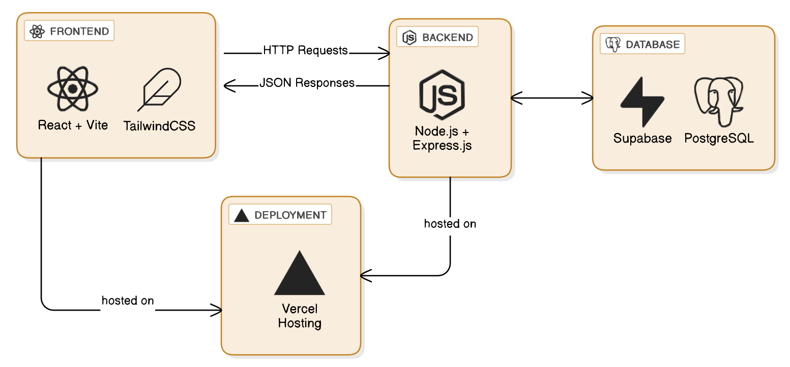

summary: Build a Mini Feedback Board - A Complete Fullstack Web Application
id: mini-feedback-board-fullstack
categories: Web Development, React, Node.js, Database
environments: Web
status: Published
feedback link: https://github.com/Bit-Blazer/

# Mini Feedback Board: Complete Fullstack Web Application

## What You'll Learn Today

Duration: 2:00

Welcome to an exciting journey into fullstack web development!

Today, you'll build a **Mini Feedback Board** - a complete web application where users can submit, view, and interact with feedback posts.

### What is Fullstack Development?

Fullstack development means building **both** the frontend (what users see) and backend (server logic) of a web application. Think of it like building a restaurant:

- **Frontend (Client)** = The dining area where customers sit and order
- **Backend (Server)** = The kitchen where food is prepared
- **Database** = The pantry where ingredients are stored
- **Deployment** = Opening the restaurant to the public

### Your Mini Feedback Board Architecture



## Prerequisites and Setup

Duration: 5:00

Before we dive in, let's make sure you have everything needed for this tutorial.

### Required Knowledge

You should be comfortable with:

- Basic HTML, CSS, and JavaScript
- Using command line/terminal
- Basic Git operations (clone, add, commit, push)

### Install Required Tools

We need three tools for fullstack development. Install them all now:

**1. Node.js (JavaScript runtime for backend)**

- Visit: [Node.js](https://nodejs.org)
- Download LTS version and install with default settings
- Verify: `node --version` and `npm --version` (should be Node 18+ and npm 8+)

**2. VS Code (code editor)**

- Visit: [VS Code](https://code.visualstudio.com)
- Download for your OS and install with default settings

**3. Git (version control)**

- **Windows:** [Git for Windows](https://git-scm.com/download/win) - install with defaults
- Configure:

```bash
git config --global user.name "Your Name"
git config --global user.email "your.email@example.com"
```

- Verify: `git --version`

## Project Structure

Duration: 4:00

Let's create the folder structure for our fullstack application and understand how we'll work with it.

### Why Separate Frontend and Backend?

- **Clear organization** - Easy to find frontend vs backend code
- **Independent deployment** - Can deploy each part separately if needed
- **Team collaboration** - Different developers can work on different parts
- **Different dependencies** - Each part has its own package.json

### Create the Project

1. **Navigate to your development folder** (create one if you don't have it):

   ```console
   cd D:\Projects
   ```

2. **Create the main project folder:**

   ```console
   mkdir mini-feedback-board
   cd mini-feedback-board
   ```

3. **Create the frontend and backend folders:**

   ```console
   mkdir frontend
   mkdir backend
   ```

4. **Verify your structure:**

   ```console
   dir
   ```

### Verify Your Setup

In VS Code, you should see:

```
mini-feedback-board/
├── frontend/
├── backend/
└── README.md
```

### Development Workflow

Now let's understand how we'll work with our fullstack setup:

**Development Process:**

1. **Backend First** - We'll build our API endpoints
2. **Test with cURL** - Verify our API works
3. **Frontend** - Build React components that consume the API
4. **Integration** - Connect frontend to backend
5. **Deploy** - Put it live on the internet

**Ports and URLs:**

During development, we'll run:

- **Backend server:** `http://localhost:3001` (Express.js API)
- **Frontend server:** `http://localhost:5173` (React + Vite)

> aside negative
> **Important:** We'll run TWO development servers simultaneously - one for frontend, one for backend. This is normal in fullstack development!

## Setup Backend with Express and CORS

Duration: 4:00

Now let's create our backend API server using Node.js and Express.js. We'll start in the `backend` folder and set up our project structure with all necessary dependencies.

### Why Express.js?

Express.js is the most popular Node.js web framework because it's:

- **Simple and minimalist** - Easy to learn and use
- **Flexible** - Can build APIs, web apps, or both
- **Well-documented** - Tons of tutorials and community support
- **Battle-tested** - Used by companies like Netflix, Uber, and WhatsApp

### Navigate to Backend Folder

First, let's navigate to our backend directory and initialize our Node.js project:

```console
cd backend
```

### Initialize npm Project

Run the npm initialization command to create a `package.json` file:

```console
npm init -y
```

The `-y` flag accepts all the default settings automatically.

### Install Required Packages

Now let's install all the packages we need for our API server:

```console
npm install express cors
```

**What we're installing:**

- **Express.js** - Our web server framework
- **CORS** - Cross-Origin Resource Sharing to allow frontend communication

### Why Do We Need CORS?

By default, browsers block requests between different ports for security. Since our:

- Frontend runs on `http://localhost:5173`
- Backend runs on `http://localhost:3001`

We need CORS to allow communication between them.

### Understanding package.json

The `package.json` file is like a blueprint for your project:

- **name** - Your project name
- **version** - Current version of your project
- **main** - Entry point file (we'll create `index.js`)
- **scripts** - Commands you can run with `npm run`
- **dependencies** - Packages your app needs to run

### Verify Installation

Check your `package.json` file. It should now include:

```json
{
  "dependencies": {
    "cors": "^2.8.5",
    "express": "^4.18.2"
  }
}
```

> aside positive
> **Pro Tip:** Think of `package.json` like a recipe card - it tells npm exactly what ingredients (dependencies) and instructions (scripts) your project needs!

## Create the Express Server

Duration: 8:00

Now let's create our main server file with a basic Express.js setup, add API routes, and test everything works properly.

### Create index.js

In your `backend` folder, create a new file called `index.js`:

```javascript
// Import required packages
const express = require("express");
const cors = require("cors");

// Create Express application
const app = express();

// Set port (use environment variable or default to 3001)
const PORT = process.env.PORT || 3001;

// Middleware
app.use(cors()); // Enable CORS for all routes
app.use(express.json()); // Parse JSON request bodies

// Basic route to test server is working
app.get("/", (req, res) => {
  res.json({
    message: "Mini Feedback Board API is running!",
    timestamp: new Date().toISOString(),
  });
});

// API Routes
app.get("/api/hello", (req, res) => {
  res.json({
    message: "Hello from the Mini Feedback Board API!",
    status: "success",
    data: {
      version: "1.0.0",
      endpoints: [
        "GET /api/hello",
        "GET /api/feedback (coming soon)",
        "POST /api/feedback (coming soon)",
      ],
    },
  });
});

// Start the server
app.listen(PORT, () => {
  console.log(`🚀 Server running on http://localhost:${PORT}`);
  console.log(`📝 API endpoints available at http://localhost:${PORT}/api`);
});
```

### Understanding the Code

Let's break down what each part does:

1. **Import packages** - We bring in Express and CORS
2. **Create app** - Initialize our Express application
3. **Set PORT** - Use environment variable or default to 3001
4. **Add middleware**:
   - `cors()` - Allows cross-origin requests
   - `express.json()` - Parses incoming JSON data
5. **Define routes** - Root endpoint and API hello endpoint
6. **Start server** - Listen on the specified port

> aside negative
> **Important:** Always use `/api/` prefix for your endpoints. This is a widely accepted standard that makes your API more professional and easier to manage.

### Add npm Scripts

Update your `package.json` scripts section to make running the server easier:

```json
{
  "scripts": {
    "start": "node index.js"
  }
}
```

### Start the Development Server

In your terminal (make sure you're in the `backend` folder), run:

```console
npm start
```

### Test in Browser

1. **Open your web browser**
2. **Navigate to:** `http://localhost:3001`

You should see:

```json
{
  "message": "Mini Feedback Board API is running!",
  "timestamp": "2024-01-15T10:30:45.123Z"
}
```

3. **Navigate to:** `http://localhost:3001/api/hello`

You should see:

```json
{
  "message": "Hello from the Mini Feedback Board API!",
  "status": "success",
  "data": {
    "version": "1.0.0",
    "endpoints": [
      "GET /api/hello",
      "GET /api/feedback (coming soon)",
      "POST /api/feedback (coming soon)"
    ]
  }
}
```

### Test with cURL Commands

Open a new terminal window (keep your server running in the first one) and test with cURL:

**Test root endpoint:**

```console
curl http://localhost:3001
```

**Test API hello endpoint:**

```console
curl http://localhost:3001/api/hello
```

## Setup Supabase

Duration: 6:00

Now we need a database to store our feedback messages! We'll use Supabase - a modern, open-source alternative to Firebase that gives us a PostgreSQL database with a RESTful API.

### Why Supabase?

Supabase is perfect for our project because it provides:

- **PostgreSQL database** - Reliable, SQL-based database
- **Instant APIs** - Automatically creates REST endpoints
- **Real-time subscriptions** - Live updates when data changes
- **Built-in authentication** - User management (for future features)
- **Free tier** - Perfect for learning and small projects
- **Easy integration** - Works seamlessly with JavaScript

### Create Your Supabase Account

1. **Visit Supabase:**

   ```console
   https://supabase.com
   ```

2. **Click "Start your project"** or **"Sign Up"**

3. **Sign up using your GitHub account** (recommended) or email

   - GitHub signup is faster and more secure
   - You can use your existing GitHub account from your development setup

4. **Verify your email** if you signed up with email

### Create a New Project

1. **Click "New Project"** on your dashboard

2. **Fill in project details:**

   - **Organization:** Use your default organization
   - **Name:** `mini-feedback-board`
   - **Database Password:** Create a strong password (save this!)
   - **Region:** Choose the region closest to you
   - **Pricing Plan:** Free (perfect for our tutorial)

3. **Click "Create new project"**

4. **Wait for setup** - This takes 1-2 minutes. Supabase is creating your PostgreSQL database and setting up all the APIs.

### Get Your API Credentials

Now we need to get our API credentials so our backend can communicate with the Supabase database.

**Find Your Project Settings:**

1. **Click the "Settings" icon** in the left sidebar (gear icon)

2. **Click "Data API"** in the settings menu

   - Look for "Project URL"
   - It looks like: `https://your-project-id.supabase.co`
   - **Copy this URL**

3. **Click "API Keys"** in the settings menu

   - Look for "Legacy API keys"
   - Find the **"anon public"** key (not the service role key)
   - It's a long string starting with `eyJ...`
   - **Copy this key**

### Understanding the Keys

**Project URL:**

- The base URL for all API requests to your database
- Think of it as your database's address on the internet

**Anon Key:**

- Allows read/write access to your database
- "Anon" means "anonymous" - no user login required
- Safe to use in frontend code (has built-in security limitations)

> aside negative
> **Keep Keys Safe:** While the anon key is safe for frontend use, never share your service role key publicly. The service role key has admin access to your database.

## Create the Messages Table

Duration: 3:00

Before creating our table, let's plan what data we need to store for each feedback message, then create it using SQL.

### Understanding Database Schema

A database **schema** is like a blueprint that defines:

- What tables we have
- What columns each table contains
- What type of data goes in each column
- Rules and constraints for the data

### Our Messages Table Structure

For our Mini Feedback Board, each feedback message needs:

| Column Name  | Data Type | Purpose             | Example                                |
| ------------ | --------- | ------------------- | -------------------------------------- |
| `id`         | UUID      | Unique identifier   | `550e8400-e29b-41d4-a716-446655440000` |
| `name`       | TEXT      | User's name         | `"Sarah Johnson"`                      |
| `message`    | TEXT      | Feedback content    | `"Great app! Love the interface."`     |
| `rating`     | INTEGER   | Rating 1-5 stars    | `4`                                    |
| `upvotes`    | INTEGER   | Number of upvotes   | `12`                                   |
| `downvotes`  | INTEGER   | Number of downvotes | `2`                                    |
| `created_at` | TIMESTAMP | When created        | `2024-01-15 10:30:45`                  |

### Why These Data Types?

- **UUID for id** - Universally unique, more secure than auto-incrementing numbers
- **TEXT for strings** - Can handle any length of text
- **INTEGER for numbers** - Perfect for counts and ratings
- **TIMESTAMP** - Automatically tracks when records are created

### Create the Table with SQL

Now let's create our database table using SQL Queries in Supabase.

**Access SQL Editor:**

1. **Go to your Supabase project dashboard**

2. **Click "SQL Editor"** in the left sidebar

3. **Click "New Query"**

**Create Table with SQL:**

Copy and paste this SQL command into the editor:

```sql
CREATE TABLE messages (
  id UUID DEFAULT gen_random_uuid() PRIMARY KEY,
  name TEXT NOT NULL,
  message TEXT NOT NULL,
  rating INTEGER DEFAULT 5 NOT NULL,
  upvotes INTEGER DEFAULT 0 NOT NULL,
  downvotes INTEGER DEFAULT 0 NOT NULL,
  created_at TIMESTAMPTZ DEFAULT NOW() NOT NULL
);
```

**Understanding the SQL:**

- `UUID DEFAULT gen_random_uuid() PRIMARY KEY` - Auto-generated unique ID
- `TEXT NOT NULL` - Required text fields for name and message
- `INTEGER DEFAULT 5 NOT NULL` - Rating defaults to 5 stars
- `INTEGER DEFAULT 0 NOT NULL` - Vote counts start at 0
- `TIMESTAMPTZ DEFAULT NOW() NOT NULL` - Auto-timestamp when created

**Execute the Query:**

1. **Click "Run"** to execute the SQL command

2. **Verify success** - You should see "Success. No rows returned" message

**Verify Your Table:**

1. **Click "Table Editor"** in the left sidebar
2. **Select the "messages" table** - You should see all 7 columns created automatically

## Setup Environment Variables

Duration: 3:00

Environment variables are a secure way to store sensitive information like API keys. Let's set them up properly.

### What Are Environment Variables?

Environment variables are like secret configuration settings that:

- **Keep sensitive data out of your code** - API keys, passwords, etc.
- **Allow different settings per environment** - development vs production
- **Prevent accidental sharing** - Won't be committed to Git
- **Make deployment easier** - Different keys for different environments

Think of them like a secure lockbox that only your application can access.

### Create .env File

In your **backend** folder, create a new file called `.env` (note the dot at the beginning):

```env
# Supabase Configuration
SUPABASE_URL=https://your-project-id.supabase.co
SUPABASE_ANON_KEY=eyJhbGciOiJIUzI1NiIsInR5cCI6IkpXVCJ9...your-full-key-here

# Server Configuration
PORT=3001
```

**Replace the placeholder values:**

- Replace `your-project-id.supabase.co` with your actual Project URL
- Replace `eyJhbGci...` with your actual anon key

### Add .env to .gitignore

Create or update your `.gitignore` file in the **backend** folder:

This prevents your secret keys from being committed to Git.

## Install Supabase JavaScript Client

Duration: 3:00

Now let's install the Supabase JavaScript client library to connect our backend to the database.

### Install the Package

In your **backend** folder, run:

```console
npm install @supabase/supabase-js
```

### Install dotenv for Environment Variables

We also need the `dotenv` package to load our environment variables:

```console
npm install dotenv
```

### Create Database Connection

Create a new file called `config/database.js` in your backend folder:

First, create the config folder:

```console
mkdir config
```

Then create the file:

```javascript
// config/database.js
const { createClient } = require("@supabase/supabase-js");

// Load environment variables
require("dotenv").config();

// Supabase configuration
const supabaseUrl = process.env.SUPABASE_URL;
const supabaseKey = process.env.SUPABASE_ANON_KEY;

// Validate environment variables
if (!supabaseUrl || !supabaseKey) {
  console.error("❌ Missing Supabase environment variables!");
  console.error(
    "Make sure SUPABASE_URL and SUPABASE_ANON_KEY are set in your .env file"
  );
  process.exit(1);
}

// Create and export Supabase client
const supabase = createClient(supabaseUrl, supabaseKey);

console.log("✅ Supabase client connected successfully");

module.exports = supabase;
```

### Update Your Main Server File

Update your `index.js` to load environment variables at the top:

```javascript
// Load environment variables first
require("dotenv").config();

// Import required packages
const express = require("express");
const cors = require("cors");

// Create Express application
const app = express();

// Set port (use environment variable or default to 3001)
const PORT = process.env.PORT || 3001;

// Rest of your existing code...
```

### Test the Connection

Restart your server:

```console
npm start
```

You should see:

```console
✅ Supabase client connected successfully
🚀 Server running on http://localhost:3001
📝 API endpoints available at http://localhost:3001/api
```

### Your Backend Structure

Your backend folder should now look like:

```
backend/
├── config/
│   └── database.js          # Supabase connection
├── node_modules/            # Installed packages
├── .env                     # Environment variables (secret)
├── .gitignore               # Git ignore file
├── index.js                 # Main server file
├── package.json             # Project configuration
└── package-lock.json        # Dependency versions
```

> aside positive
> **Database Connected!** Your backend can now communicate with your Supabase database. The green checkmark confirms everything is working properly.

## Connect Express Backend to Supabase

Duration: 3:00

Now it's time to build the real API endpoints that will power our Mini Feedback Board! We'll create routes to read messages, create new messages, and handle voting.

### Understanding CRUD Operations

**CRUD** stands for the four basic database operations:

- **C**reate - Add new data (POST requests)
- **R**ead - Get existing data (GET requests)
- **U**pdate - Modify existing data (PUT/PATCH requests)
- **D**elete - Remove data (DELETE requests)

For our feedback board, we'll implement:

- **Read** - Get all feedback messages
- **Create** - Add new feedback messages
- **Update** - Upvote/downvote messages (partial update)

### API Design Planning

Our API will have these endpoints:

| Method | Endpoint        | Purpose            | Example               |
| ------ | --------------- | ------------------ | --------------------- |
| GET    | `/api/messages` | Get all messages   | Display feedback list |
| POST   | `/api/messages` | Create new message | Submit feedback       |
| POST   | `/api/vote`     | Vote on message    | Like/dislike posts    |

## Create GET /api/messages Route

Duration: 4:00

Let's start with reading data - the foundation of our feedback board. This endpoint will fetch all messages from our database.

### Add the GET Messages Route

Add this route to your `index.js` file, after your existing routes and before `app.listen()`:

```javascript
// Import the database connection
const supabase = require("./config/database");

// ... existing routes ...

// GET all messages
app.get("/api/messages", async (req, res) => {
  try {
    // Fetch all messages from database, ordered by creation date (newest first)
    const { data, error } = await supabase
      .from("messages")
      .select("*")
      .order("created_at", { ascending: false });

    // Handle database errors
    if (error) {
      console.error("Database error:", error);
      return res.status(500).json({
        message: "Failed to fetch messages",
        status: "error",
        error: error.message,
      });
    }

    // Return successful response with messages
    res.json({
      message: "Messages retrieved successfully",
      status: "success",
      data: {
        messages: data,
        count: data.length,
        timestamp: new Date().toISOString(),
      },
    });
  } catch (error) {
    console.error("Server error:", error);
    res.status(500).json({
      message: "Internal server error",
      status: "error",
      error: error.message,
    });
  }
});
```

### Understanding the Code

**Supabase Query Breakdown:**

- `.from('messages')` - Select the messages table
- `.select('*')` - Get all columns
- `.order('created_at', { ascending: false })` - Sort newest first

**Error Handling:**

- Database errors (Supabase issues)
- Server errors (code issues)
- Consistent error response format

**Response Structure:**

- Always includes `message`, `status`, and `data`
- Provides message count for frontend convenience
- Includes timestamp for debugging

### Test the GET Route

1. **Save your file** and restart the server

2. **Test in browser:** Go to `http://localhost:3001/api/messages`

3. **Test with cURL:**

   ```console
   curl http://localhost:3001/api/messages
   ```

### Expected Response (Empty Database)

Since we haven't added any messages yet, you should see:

```json
{
  "message": "Messages retrieved successfully",
  "status": "success",
  "data": {
    "messages": [],
    "count": 0,
    "timestamp": "2024-01-15T10:30:45.123Z"
  }
}
```

The empty `messages` array is perfect - it confirms our database connection works!

## Create POST /api/messages Route

Duration: 6:00

Now let's build the endpoint to create new feedback messages. This is where users will submit their feedback.

### Add Input Validation Helper

First, let's create a helper function for validating message data. Add this before your routes:

```javascript
// Input validation helper
const validateMessageInput = (data) => {
  const errors = [];

  // Check required fields
  if (!data.name || data.name.trim() === "") {
    errors.push("Name is required");
  }

  if (!data.message || data.message.trim() === "") {
    errors.push("Message is required");
  }

  // Validate data types and ranges
  if (data.rating && (data.rating < 1 || data.rating > 5)) {
    errors.push("Rating must be between 1 and 5");
  }

  // Validate string lengths
  if (data.name && data.name.length > 100) {
    errors.push("Name must be less than 100 characters");
  }

  if (data.message && data.message.length > 1000) {
    errors.push("Message must be less than 1000 characters");
  }

  return errors;
};
```

### Add the POST Messages Route

Add this route after your GET messages route:

```javascript
// POST - Create new message
app.post("/api/messages", async (req, res) => {
  try {
    // Extract data from request body
    const { name, message, rating = 5 } = req.body;

    // Validate input data
    const validationErrors = validateMessageInput({ name, message, rating });
    if (validationErrors.length > 0) {
      return res.status(400).json({
        message: "Validation failed",
        status: "error",
        errors: validationErrors,
      });
    }

    // Prepare data for database insertion
    const newMessage = {
      name: name.trim(),
      message: message.trim(),
      rating: parseInt(rating),
      upvotes: 0,
      downvotes: 0,
    };

    // Insert into database
    const { data, error } = await supabase
      .from("messages")
      .insert([newMessage])
      .select(); // Return the inserted data

    // Handle database errors
    if (error) {
      console.error("Database error:", error);
      return res.status(500).json({
        message: "Failed to create message",
        status: "error",
        error: error.message,
      });
    }

    // Return successful response
    res.status(201).json({
      message: "Message created successfully",
      status: "success",
      data: {
        message: data[0], // Return the created message
        timestamp: new Date().toISOString(),
      },
    });
  } catch (error) {
    console.error("Server error:", error);
    res.status(500).json({
      message: "Internal server error",
      status: "error",
      error: error.message,
    });
  }
});
```

### Understanding the POST Route

**Input Validation:**

- Checks required fields (name, message)
- Validates data types and ranges
- Prevents overly long inputs

**Data Processing:**

- Trims whitespace from strings
- Sets default rating of 5
- Initializes vote counts to 0

**Database Operation:**

- `.insert([newMessage])` - Insert the new message
- `.select()` - Return the inserted data with generated fields

**HTTP Status Codes:**

- `201` - Created successfully
- `400` - Bad request (validation errors)
- `500` - Server error

### Test the POST Route

Let's test creating a new message with cURL:

```console
curl -X POST http://localhost:3001/api/messages `
  -H "Content-Type: application/json" `
  -d '{"name":"Sarah Johnson","message":"This app is amazing! Really intuitive interface.","rating":5}'
```

### Expected Response

You should see:

```json
{
  "message": "Message created successfully",
  "status": "success",
  "data": {
    "message": {
      "id": "550e8400-e29b-41d4-a716-446655440000",
      "name": "Sarah Johnson",
      "message": "This app is amazing! Really intuitive interface.",
      "rating": 5,
      "upvotes": 0,
      "downvotes": 0,
      "created_at": "2024-01-15T10:30:45.123456+00:00"
    },
    "timestamp": "2024-01-15T10:30:45.123Z"
  }
}
```

### Verify Data Was Saved

Test your GET route again:

```console
curl http://localhost:3001/api/messages
```

You should now see your new message in the response!

## Create POST /api/vote Route

Duration: 5:00

Now let's add the voting functionality so users can upvote or downvote feedback messages.

### Understanding the Voting System

Our voting system will:

- Accept a message ID and vote type (upvote/downvote)
- Update the vote count in the database
- Return the updated message
- Prevent invalid vote types or missing IDs

### Add Vote Validation Helper

Add this validation function with your other helpers:

```javascript
// Vote validation helper
const validateVoteInput = (data) => {
  const errors = [];

  // Check required fields
  if (!data.messageId) {
    errors.push("Message ID is required");
  }

  if (!data.voteType) {
    errors.push("Vote type is required");
  }

  // Validate vote type
  if (data.voteType && !["upvote", "downvote"].includes(data.voteType)) {
    errors.push('Vote type must be either "upvote" or "downvote"');
  }

  return errors;
};
```

### Add the POST Vote Route

Add this route after your other API routes:

```javascript
// POST - Vote on a message
app.post("/api/vote", async (req, res) => {
  try {
    // Extract data from request body
    const { messageId, voteType } = req.body;

    // Validate input data
    const validationErrors = validateVoteInput({ messageId, voteType });
    if (validationErrors.length > 0) {
      return res.status(400).json({
        message: "Validation failed",
        status: "error",
        errors: validationErrors,
      });
    }

    // First, get the current message to check if it exists
    const { data: currentMessage, error: fetchError } = await supabase
      .from("messages")
      .select("*")
      .eq("id", messageId)
      .single(); // Get single record

    if (fetchError || !currentMessage) {
      return res.status(404).json({
        message: "Message not found",
        status: "error",
        error: "No message found with the provided ID",
      });
    }

    // Prepare the update based on vote type
    let updateData = {};
    if (voteType === "upvote") {
      updateData.upvotes = currentMessage.upvotes + 1;
    } else {
      updateData.downvotes = currentMessage.downvotes + 1;
    }

    // Update the message in database
    const { data, error } = await supabase
      .from("messages")
      .update(updateData)
      .eq("id", messageId)
      .select(); // Return updated data

    // Handle database errors
    if (error) {
      console.error("Database error:", error);
      return res.status(500).json({
        message: "Failed to update vote",
        status: "error",
        error: error.message,
      });
    }

    // Return successful response
    res.json({
      message: `${voteType} recorded successfully`,
      status: "success",
      data: {
        message: data[0], // Return updated message
        voteType: voteType,
        timestamp: new Date().toISOString(),
      },
    });
  } catch (error) {
    console.error("Server error:", error);
    res.status(500).json({
      message: "Internal server error",
      status: "error",
      error: error.message,
    });
  }
});
```

### Understanding the Vote Route

**Two-Step Process:**

1. **Check if message exists** - Prevents voting on non-existent messages
2. **Update the vote count** - Increment upvotes or downvotes

**Database Operations:**

- `.eq('id', messageId)` - Find message by ID
- `.single()` - Get exactly one record
- `.update(updateData)` - Update specific fields

**Error Handling:**

- Message not found (404 status)
- Database errors (500 status)
- Validation errors (400 status)

> aside positive
> **Voting System Complete!** Your API now supports full CRUD operations with proper validation and error handling. Users can create messages, view them, and vote on them!

## Setup React Frontend with Vite and TailwindCSS

Duration: 6:00

Time to build the user interface! We'll use Vite to create our React application and TailwindCSS for styling. Vite is a modern build tool that's much faster than traditional tools like Create React App (deprecated).

### Navigate to Frontend Directory

Make sure you're in your main project directory, then navigate to the frontend folder:

```console
cd frontend
```

Your terminal should show you're in the frontend directory:

```console
D:\Projects\mini-feedback-board\frontend>
```

### Create Vite Project

Run the Vite creation command:

```console
npx create-vite@latest . --template react
```

### Install Dependencies

Install all the React dependencies:

```console
npm install
```

### Install and Configure TailwindCSS

TailwindCSS is a utility-first CSS framework that makes styling fast and consistent. Instead of writing custom CSS, you use predefined classes.

**Install TailwindCSS:**

In your frontend directory, install TailwindCSS and its dependencies:

```console
npm install tailwindcss @tailwindcss/vite
```

**Configure the Vite plugin:**

Add the `@tailwindcss/vite` plugin to your Vite configuration `vite.config.js`:

```javascript
import { defineConfig } from "vite";
import tailwindcss from "@tailwindcss/vite";

export default defineConfig({
  plugins: [tailwindcss()],
});
```

**Add Tailwind to Your CSS:**

Add an @import to your `src/index.css` CSS file that imports Tailwind CSS:

```css
@import "tailwindcss";
```

### Test the React App

Start the development server:

```console
npm run dev
```

**Open your browser** and go to `http://localhost:5173/`

You should see the default Vite + React welcome page with the Vite and React logos.

> aside positive
> **React App Running!** You now have a blazing-fast React development server running on port 5173 with TailwindCSS configured. Notice how quickly it started compared to other tools! That's the power of Vite.

## Create Basic Layout Structure

Duration: 6:00

Now let's create the basic layout for our feedback board: a header, a form to submit feedback, and a list to display feedback messages.

### Create Components Directory

First, let's organize our code properly:

```console
mkdir src/components
```

### Create Header Component

Create `src/components/Header.jsx`:

```jsx
function Header() {
  return (
    <header className="bg-white shadow-sm border-b border-gray-200">
      <div className="max-w-4xl mx-auto px-4 py-6">
        <div className="text-center">
          <h1 className="text-3xl font-bold text-gray-900 mb-2">
            Mini Feedback Board
          </h1>
          <p className="text-gray-600 text-lg">
            Share your thoughts and feedback with the community
          </p>
        </div>
      </div>
    </header>
  );
}

export default Header;
```

### Create Footer Component

Create `src/components/Footer.jsx`:

```jsx
function Footer() {
  return (
    <footer className="bg-white border-t border-gray-200 mt-12">
      <div className="max-w-6xl mx-auto px-4 py-6">
        <p className="text-center text-gray-600">
          Built with React, Vite, TailwindCSS, and Supabase
        </p>
      </div>
    </footer>
  );
}

export default Footer;
```

### Create Feedback Form Component

Create `src/components/FeedbackForm.jsx`:

```jsx
import { useState } from "react";

function FeedbackForm() {
  const [formData, setFormData] = useState({
    name: "",
    message: "",
    rating: 5,
  });

  const handleInputChange = (e) => {
    const { name, value } = e.target;
    setFormData((prev) => ({
      ...prev,
      [name]: value,
    }));
  };

  const handleSubmit = (e) => {
    e.preventDefault();
    console.log("Form submitted:", formData);
    // We'll connect this to our API later
  };

  return (
    <div className="max-w-2xl mx-auto bg-white rounded-lg shadow-md p-6 mb-8">
      <h2 className="text-2xl font-semibold text-gray-800 mb-6">
        Submit Your Feedback
      </h2>

      <form onSubmit={handleSubmit} className="space-y-4">
        {/* Name Input */}
        <div>
          <label
            htmlFor="name"
            className="block text-sm font-medium text-gray-700 mb-2"
          >
            Your Name
          </label>
          <input
            type="text"
            id="name"
            name="name"
            value={formData.name}
            onChange={handleInputChange}
            className="w-full px-3 py-2 border border-gray-300 rounded-md focus:outline-none focus:ring-2 focus:ring-blue-500 focus:border-transparent"
            placeholder="Enter your name..."
            required
          />
        </div>

        {/* Message Input */}
        <div>
          <label
            htmlFor="message"
            className="block text-sm font-medium text-gray-700 mb-2"
          >
            Your Feedback
          </label>
          <textarea
            id="message"
            name="message"
            value={formData.message}
            onChange={handleInputChange}
            rows={4}
            className="w-full px-3 py-2 border border-gray-300 rounded-md focus:outline-none focus:ring-2 focus:ring-blue-500 focus:border-transparent resize-none"
            placeholder="Share your thoughts, suggestions, or feedback..."
            required
          />
        </div>

        {/* Rating Input */}
        <div>
          <label
            htmlFor="rating"
            className="block text-sm font-medium text-gray-700 mb-2"
          >
            Rating
          </label>
          <select
            id="rating"
            name="rating"
            value={formData.rating}
            onChange={handleInputChange}
            className="w-full px-3 py-2 border border-gray-300 rounded-md focus:outline-none focus:ring-2 focus:ring-blue-500 focus:border-transparent"
          >
            <option value={5}>⭐⭐⭐⭐⭐ (5 stars)</option>
            <option value={4}>⭐⭐⭐⭐ (4 stars)</option>
            <option value={3}>⭐⭐⭐ (3 stars)</option>
            <option value={2}>⭐⭐ (2 stars)</option>
            <option value={1}>⭐ (1 star)</option>
          </select>
        </div>

        {/* Submit Button */}
        <div>
          <button type="submit" className="w-full btn-primary">
            Submit Feedback
          </button>
        </div>
      </form>
    </div>
  );
}

export default FeedbackForm;
```

### Create Feedback List Component

Create `src/components/FeedbackList.jsx`:

```jsx
import { useState } from "react";

function FeedbackList() {
  // Sample data for now - we'll replace this with API data later
  const [messages] = useState([
    {
      id: "1",
      name: "Sarah Johnson",
      message:
        "This app is amazing! Really intuitive interface and great user experience.",
      rating: 5,
      upvotes: 12,
      downvotes: 2,
      created_at: "2024-01-15T10:30:00Z",
    },
    {
      id: "2",
      name: "Alex Chen",
      message:
        "Love the clean design and fast performance. Could use more features though.",
      rating: 4,
      upvotes: 8,
      downvotes: 1,
      created_at: "2024-01-15T09:15:00Z",
    },
    {
      id: "3",
      name: "Maria Garcia",
      message:
        "Good start but needs more customization options. Keep up the good work!",
      rating: 3,
      upvotes: 5,
      downvotes: 3,
      created_at: "2024-01-15T08:45:00Z",
    },
  ]);

  const handleVote = (messageId, voteType) => {
    console.log(`${voteType} on message ${messageId}`);
    // We'll connect this to our API later
  };

  const formatDate = (dateString) => {
    return new Date(dateString).toLocaleDateString("en-US", {
      year: "numeric",
      month: "short",
      day: "numeric",
      hour: "2-digit",
      minute: "2-digit",
    });
  };

  const renderStars = (rating) => {
    return "⭐".repeat(rating) + "☆".repeat(5 - rating);
  };

  return (
    <div className="max-w-4xl mx-auto">
      <h2 className="text-2xl font-semibold text-gray-800 mb-6">
        Community Feedback ({messages.length})
      </h2>

      <div className="space-y-4">
        {messages.map((message) => (
          <div key={message.id} className="bg-white rounded-lg shadow-md p-6">
            {/* Header with name, rating, and date */}
            <div className="flex items-center justify-between mb-4">
              <div className="flex items-center space-x-3">
                <div className="w-10 h-10 bg-blue-500 text-white rounded-full flex items-center justify-center font-semibold">
                  {message.name.charAt(0).toUpperCase()}
                </div>
                <div>
                  <h3 className="font-semibold text-gray-900">
                    {message.name}
                  </h3>
                  <p className="text-sm text-gray-500">
                    {formatDate(message.created_at)}
                  </p>
                </div>
              </div>
              <div className="text-right">
                <div className="text-lg">{renderStars(message.rating)}</div>
                <p className="text-sm text-gray-500">{message.rating}/5</p>
              </div>
            </div>

            {/* Message content */}
            <p className="text-gray-700 mb-4">{message.message}</p>

            {/* Voting buttons */}
            <div className="flex items-center space-x-4">
              <button
                onClick={() => handleVote(message.id, "upvote")}
                className="flex items-center space-x-2 px-3 py-2 text-green-600 hover:bg-green-50 rounded-md transition-colors"
              >
                <span className="text-lg">👍</span>
                <span className="font-medium">{message.upvotes}</span>
              </button>

              <button
                onClick={() => handleVote(message.id, "downvote")}
                className="flex items-center space-x-2 px-3 py-2 text-red-600 hover:bg-red-50 rounded-md transition-colors"
              >
                <span className="text-lg">👎</span>
                <span className="font-medium">{message.downvotes}</span>
              </button>
            </div>
          </div>
        ))}
      </div>
    </div>
  );
}

export default FeedbackList;
```

### Update Main App Component

Update your `src/App.jsx` to use all the components:

```jsx
import Header from "./components/Header";
import FeedbackForm from "./components/FeedbackForm";
import FeedbackList from "./components/FeedbackList";
import Footer from "./components/Footer";

function App() {
  return (
    <div className="min-h-screen bg-gray-50">
      <Header />

      <main className="max-w-6xl mx-auto px-4 py-8">
        <FeedbackForm />
        <FeedbackList />
      </main>

      <Footer />
    </div>
  );
}

export default App;
```

### Clean Up Default Styles

Remove the default Vite styles by emptying `src/App.css`:

```css
/* This file is now empty - we're using TailwindCSS instead */
```

### Run Development Server

Make sure your frontend development server is still running:

```console
npm run dev
```

### Test the User Interface

**Open your browser** and go to `http://localhost:5173/`

### Your Project Structure

Your frontend folder should now look like:

```
frontend/
├── public/
│   └── vite.svg
├── src/
│   ├── components/
│   │   ├── Header.jsx
│   │   ├── FeedbackForm.jsx
│   │   └── FeedbackList.jsx
│   ├── assets/
│   ├── App.css
│   ├── App.jsx
│   ├── index.css
│   └── main.jsx
├── index.html
├── package.json
├── postcss.config.js
├── tailwind.config.js
└── vite.config.js
```

> aside positive
> **Frontend Complete!** Your React application has a beautiful, functional user interface with proper component structure, responsive design, and interactive elements.

> aside negative
> **Two Servers Running:** You should now have **TWO** development servers running - your backend API (port 3001) and frontend React app (port 5173). This is normal for fullstack development!

## Fetch Messages from Backend API

Duration: 7:00

Now it's time for the magic moment - connecting your beautiful React frontend to your powerful backend API! We'll replace the sample data with real data from your database.

### Understanding Frontend-Backend Communication

Your architecture now looks like this:

```
React Frontend (Port 5173) ←→ Express Backend (Port 3001) ←→ Supabase Database
     User Interface                    API Endpoints              Data Storage
```

**How it works:**

1. React makes HTTP requests to your API
2. Express processes the requests and queries Supabase
3. Supabase returns data to Express
4. Express sends JSON response back to React
5. React updates the UI with the new data

### Create API Utilities

First, let's create a utility file for all our API calls. Create `src/utils/api.js`:

```javascript
// API base URL - your backend server
const API_BASE_URL = "http://localhost:3001/api";

// Utility function to handle API requests
const apiRequest = async (endpoint, options = {}) => {
  const url = `${API_BASE_URL}${endpoint}`;

  const config = {
    headers: {
      "Content-Type": "application/json",
      ...options.headers,
    },
    ...options,
  };

  try {
    const response = await fetch(url, config);
    const data = await response.json();

    if (!response.ok) {
      throw new Error(data.message || "An error occurred");
    }

    return data;
  } catch (error) {
    console.error("API request failed:", error);
    throw error;
  }
};

// API functions
export const api = {
  // Get all messages
  getMessages: async () => {
    return apiRequest("/messages");
  },

  // Create a new message
  createMessage: async (messageData) => {
    return apiRequest("/messages", {
      method: "POST",
      body: JSON.stringify(messageData),
    });
  },

  // Vote on a message
  vote: async (messageId, voteType) => {
    return apiRequest("/vote", {
      method: "POST",
      body: JSON.stringify({ messageId, voteType }),
    });
  },
};
```

### Update FeedbackList Component

Now let's update the `FeedbackList` component to fetch real data. Replace the content of `src/components/FeedbackList.jsx`:

```jsx
import { useState, useEffect } from "react";
import { api } from "../utils/api";

function FeedbackList({ refreshTrigger }) {
  const [messages, setMessages] = useState([]);
  const [loading, setLoading] = useState(true);
  const [error, setError] = useState(null);

  // Fetch messages from API
  const fetchMessages = async () => {
    try {
      setLoading(true);
      setError(null);
      const response = await api.getMessages();
      setMessages(response.data.messages);
    } catch (err) {
      setError("Failed to load messages. Please try again.");
      console.error("Error fetching messages:", err);
    } finally {
      setLoading(false);
    }
  };

  // Fetch messages on component mount and when refreshTrigger changes
  useEffect(() => {
    fetchMessages();
  }, [refreshTrigger]);

  const handleVote = async (messageId, voteType) => {
    try {
      // Optimistically update UI
      setMessages((prevMessages) =>
        prevMessages.map((msg) =>
          msg.id === messageId
            ? {
                ...msg,
                [voteType === "upvote" ? "upvotes" : "downvotes"]:
                  msg[voteType === "upvote" ? "upvotes" : "downvotes"] + 1,
              }
            : msg
        )
      );

      // Make API call
      await api.vote(messageId, voteType);

      // Show subtle success feedback
      const button = document.querySelector(
        `[data-vote="${messageId}-${voteType}"]`
      );
      if (button) {
        button.style.transform = "scale(1.1)";
        setTimeout(() => {
          button.style.transform = "scale(1)";
        }, 200);
      }

      // Refresh data to get accurate counts
      setTimeout(() => fetchMessages(), 500);
    } catch (err) {
      console.error("Error voting:", err);
      // Revert optimistic update on error
      fetchMessages();

      // Show error message
      const errorDiv = document.createElement("div");
      errorDiv.className =
        "fixed top-4 right-4 bg-red-500 text-white px-4 py-2 rounded-md z-50";
      errorDiv.textContent = "Failed to record vote. Please try again.";
      document.body.appendChild(errorDiv);

      setTimeout(() => {
        if (errorDiv.parentNode) {
          errorDiv.parentNode.removeChild(errorDiv);
        }
      }, 3000);
    }
  };

  const formatDate = (dateString) => {
    return new Date(dateString).toLocaleDateString("en-US", {
      year: "numeric",
      month: "short",
      day: "numeric",
      hour: "2-digit",
      minute: "2-digit",
    });
  };

  const renderStars = (rating) => {
    return "⭐".repeat(rating) + "☆".repeat(5 - rating);
  };

  // Loading state
  if (loading) {
    return (
      <div className="max-w-4xl mx-auto">
        <h2 className="text-2xl font-semibold text-gray-800 mb-6">
          Community Feedback
        </h2>
        <div className="flex justify-center items-center py-12">
          <div className="animate-spin rounded-full h-12 w-12 border-b-2 border-blue-500"></div>
          <span className="ml-4 text-gray-600">Loading messages...</span>
        </div>
      </div>
    );
  }

  // Error state
  if (error) {
    return (
      <div className="max-w-4xl mx-auto">
        <h2 className="text-2xl font-semibold text-gray-800 mb-6">
          Community Feedback
        </h2>
        <div className="bg-red-50 border border-red-200 rounded-md p-4">
          <div className="text-red-800 font-medium">Error loading messages</div>
          <div className="text-red-600 text-sm mt-1">{error}</div>
          <button onClick={fetchMessages} className="mt-3 btn-primary">
            Try Again
          </button>
        </div>
      </div>
    );
  }

  // Empty state
  if (messages.length === 0) {
    return (
      <div className="max-w-4xl mx-auto">
        <h2 className="text-2xl font-semibold text-gray-800 mb-6">
          Community Feedback (0)
        </h2>
        <div className="text-center py-12 bg-white rounded-lg shadow-md">
          <div className="text-6xl mb-4">💬</div>
          <h3 className="text-xl font-semibold text-gray-800 mb-2">
            No feedback yet
          </h3>
          <p className="text-gray-600">Be the first to share your thoughts!</p>
        </div>
      </div>
    );
  }

  // Messages list
  return (
    <div className="max-w-4xl mx-auto">
      <h2 className="text-2xl font-semibold text-gray-800 mb-6">
        Community Feedback ({messages.length})
      </h2>

      <div className="space-y-4">
        {messages.map((message) => (
          <div key={message.id} className="bg-white rounded-lg shadow-md p-6">
            {/* Header with name, rating, and date */}
            <div className="flex items-center justify-between mb-4">
              <div className="flex items-center space-x-3">
                <div className="w-10 h-10 bg-blue-500 text-white rounded-full flex items-center justify-center font-semibold">
                  {message.name.charAt(0).toUpperCase()}
                </div>
                <div>
                  <h3 className="font-semibold text-gray-900">
                    {message.name}
                  </h3>
                  <p className="text-sm text-gray-500">
                    {formatDate(message.created_at)}
                  </p>
                </div>
              </div>
              <div className="text-right">
                <div className="text-lg">{renderStars(message.rating)}</div>
                <p className="text-sm text-gray-500">{message.rating}/5</p>
              </div>
            </div>
            {/* Message content */}
            <p className="text-gray-700 mb-4">{message.message}</p>
            {/* Voting buttons */}
            <div className="flex items-center space-x-4">
              <button
                data-vote={`${message.id}-upvote`}
                onClick={() => handleVote(message.id, "upvote")}
                className="flex items-center space-x-2 px-3 py-2 text-green-600 hover:bg-green-50 rounded-md transition-all duration-200"
              >
                <span className="text-lg">👍</span>
                <span className="font-medium">{message.upvotes}</span>
              </button>

              <button
                data-vote={`${message.id}-downvote`}
                onClick={() => handleVote(message.id, "downvote")}
                className="flex items-center space-x-2 px-3 py-2 text-red-600 hover:bg-red-50 rounded-md transition-all duration-200"
              >
                <span className="text-lg">👎</span>
                <span className="font-medium">{message.downvotes}</span>
              </button>
            </div>;
          </div>
        ))}
      </div>
    </div>
  );
}

export default FeedbackList;
```

### Test Real Data Fetching

1. **Make sure your backend server is running** in the backend directory:

   ```console
   npm run dev
   ```

2. **Make sure your frontend is running** in the frontend directory:

   ```console
   npm run dev
   ```

3. **Open your browser** to `http://localhost:5173/`

You should now see:

- A loading spinner initially
- Real messages from your database (if any exist)
- Or an empty state if no messages exist yet

### Verify the API Connection

Check your browser's Developer Tools (F12) → Network tab:

- You should see a request to `http://localhost:3001/api/messages`
- The response should show your actual database data

## Implement Form Submission

Duration: 8:00

Now let's connect the feedback form to actually create new messages in your database.

### Update FeedbackForm Component

Replace the content of `src/components/FeedbackForm.jsx`:

```jsx
import { useState } from "react";
import { api } from "../utils/api";

function FeedbackForm({ onSubmitSuccess }) {
  const [formData, setFormData] = useState({
    name: "",
    message: "",
    rating: 5,
  });
  const [isSubmitting, setIsSubmitting] = useState(false);
  const [errors, setErrors] = useState({});
  const [successMessage, setSuccessMessage] = useState("");

  const handleInputChange = (e) => {
    const { name, value } = e.target;
    setFormData((prev) => ({
      ...prev,
      [name]: value,
    }));

    // Clear error for this field when user starts typing
    if (errors[name]) {
      setErrors((prev) => ({
        ...prev,
        [name]: "",
      }));
    }
  };

  const validateForm = () => {
    const newErrors = {};

    if (!formData.name.trim()) {
      newErrors.name = "Name is required";
    } else if (formData.name.length > 100) {
      newErrors.name = "Name must be less than 100 characters";
    }

    if (!formData.message.trim()) {
      newErrors.message = "Message is required";
    } else if (formData.message.length > 1000) {
      newErrors.message = "Message must be less than 1000 characters";
    }

    if (formData.rating < 1 || formData.rating > 5) {
      newErrors.rating = "Rating must be between 1 and 5";
    }

    return newErrors;
  };

  const handleSubmit = async (e) => {
    e.preventDefault();
    setSuccessMessage("");

    // Validate form
    const validationErrors = validateForm();
    if (Object.keys(validationErrors).length > 0) {
      setErrors(validationErrors);
      return;
    }

    setIsSubmitting(true);
    setErrors({});

    try {
      // Submit to API
      await api.createMessage({
        name: formData.name.trim(),
        message: formData.message.trim(),
        rating: parseInt(formData.rating),
      });

      // Success! Clear form and show message
      setFormData({
        name: "",
        message: "",
        rating: 5,
      });
      setSuccessMessage(
        "Thank you! Your feedback has been submitted successfully."
      );

      // Notify parent component to refresh the list
      if (onSubmitSuccess) {
        onSubmitSuccess();
      }

      // Clear success message after 5 seconds
      setTimeout(() => setSuccessMessage(""), 5000);
    } catch (err) {
      console.error("Error submitting feedback:", err);
      setErrors({
        submit: "Failed to submit feedback. Please try again.",
      });
    } finally {
      setIsSubmitting(false);
    }
  };

  return (
    <div className="max-w-2xl mx-auto bg-white rounded-lg shadow-md p-6 mb-8">
      <h2 className="text-2xl font-semibold text-gray-800 mb-6">
        Submit Your Feedback
      </h2>

      {/* Success Message */}
      {successMessage && (
        <div className="mb-6 bg-green-50 border border-green-200 rounded-md p-4">
          <div className="flex items-center">
            <span className="text-green-500 text-xl mr-3">✅</span>
            <span className="text-green-800 font-medium">{successMessage}</span>
          </div>
        </div>
      )}

      {/* Submit Error */}
      {errors.submit && (
        <div className="mb-6 bg-red-50 border border-red-200 rounded-md p-4">
          <div className="flex items-center">
            <span className="text-red-500 text-xl mr-3">❌</span>
            <span className="text-red-800 font-medium">{errors.submit}</span>
          </div>
        </div>
      )}

      <form onSubmit={handleSubmit} className="space-y-4">
        {/* Name Input */}
        <div>
          <label
            htmlFor="name"
            className="block text-sm font-medium text-gray-700 mb-2"
          >
            Your Name *
          </label>
          <input
            type="text"
            id="name"
            name="name"
            value={formData.name}
            onChange={handleInputChange}
            className={`w-full px-3 py-2 border rounded-md focus:outline-none focus:ring-2 focus:ring-blue-500 focus:border-transparent ${
              errors.name ? "border-red-300" : "border-gray-300"
            }`}
            placeholder="Enter your name..."
            disabled={isSubmitting}
          />
          {errors.name && (
            <p className="mt-1 text-sm text-red-600">{errors.name}</p>
          )}
        </div>

        {/* Message Input */}
        <div>
          <label
            htmlFor="message"
            className="block text-sm font-medium text-gray-700 mb-2"
          >
            Your Feedback *
          </label>
          <textarea
            id="message"
            name="message"
            value={formData.message}
            onChange={handleInputChange}
            rows={4}
            className={`w-full px-3 py-2 border rounded-md focus:outline-none focus:ring-2 focus:ring-blue-500 focus:border-transparent resize-none ${
              errors.message ? "border-red-300" : "border-gray-300"
            }`}
            placeholder="Share your thoughts, suggestions, or feedback..."
            disabled={isSubmitting}
          />
          {errors.message && (
            <p className="mt-1 text-sm text-red-600">{errors.message}</p>
          )}
          <p className="mt-1 text-sm text-gray-500">
            {formData.message.length}/1000 characters
          </p>
        </div>

        {/* Rating Input */}
        <div>
          <label
            htmlFor="rating"
            className="block text-sm font-medium text-gray-700 mb-2"
          >
            Rating
          </label>
          <select
            id="rating"
            name="rating"
            value={formData.rating}
            onChange={handleInputChange}
            className="w-full px-3 py-2 border border-gray-300 rounded-md focus:outline-none focus:ring-2 focus:ring-blue-500 focus:border-transparent"
            disabled={isSubmitting}
          >
            <option value={5}>⭐⭐⭐⭐⭐ (5 stars)</option>
            <option value={4}>⭐⭐⭐⭐ (4 stars)</option>
            <option value={3}>⭐⭐⭐ (3 stars)</option>
            <option value={2}>⭐⭐ (2 stars)</option>
            <option value={1}>⭐ (1 star)</option>
          </select>
        </div>

        {/* Submit Button */}
        <div>
          <button
            type="submit"
            disabled={isSubmitting}
            className="w-full btn-primary disabled:opacity-50 disabled:cursor-not-allowed"
          >
            {isSubmitting ? (
              <span className="flex items-center justify-center">
                <svg
                  className="animate-spin -ml-1 mr-3 h-5 w-5 text-white"
                  xmlns="http://www.w3.org/2000/svg"
                  fill="none"
                  viewBox="0 0 24 24"
                >
                  <circle
                    className="opacity-25"
                    cx="12"
                    cy="12"
                    r="10"
                    stroke="currentColor"
                    strokeWidth="4"
                  ></circle>
                  <path
                    className="opacity-75"
                    fill="currentColor"
                    d="m4 12a8 8 0 018-8V0C5.373 0 0 5.373 0 12h4zm2 5.291A7.962 7.962 0 014 12H0c0 3.042 1.135 5.824 3 7.938l3-2.647z"
                  ></path>
                </svg>
                Submitting...
              </span>
            ) : (
              "Submit Feedback"
            )}
          </button>
        </div>
      </form>
    </div>
  );
}

export default FeedbackForm;
```

### Update Main App Component

Update `src/App.jsx` to handle form submission success:

```jsx
import { useState } from "react";
import Header from "./components/Header";
import FeedbackForm from "./components/FeedbackForm";
import FeedbackList from "./components/FeedbackList";

function App() {
  const [refreshTrigger, setRefreshTrigger] = useState(0);

  const handleFormSubmitSuccess = () => {
    // Trigger refresh of the feedback list
    setRefreshTrigger((prev) => prev + 1);
  };

  return (
    <div className="min-h-screen bg-gray-50">
      <Header />

      <main className="max-w-6xl mx-auto px-4 py-8">
        <FeedbackForm onSubmitSuccess={handleFormSubmitSuccess} />
        <FeedbackList refreshTrigger={refreshTrigger} />
      </main>

      <footer className="bg-white border-t border-gray-200 mt-12">
        <div className="max-w-6xl mx-auto px-4 py-6">
          <p className="text-center text-gray-600">
            Built with React, Vite, TailwindCSS, and Supabase
          </p>
        </div>
      </footer>
    </div>
  );
}

export default App;
```

## Prepare for Deployment

Duration: 5:00

Time to make your application live on the internet! We'll deploy both your backend API and frontend to Vercel, a modern deployment platform that's perfect for fullstack applications.

### Understanding Deployment Architecture

When we deploy to production, our architecture changes:

```
DEVELOPMENT (Local)                    PRODUCTION (Live)
Frontend: localhost:5173        →      Frontend: your-app.vercel.app
Backend:  localhost:3001        →      Backend:  your-api.vercel.app
Database: Supabase (same)      →      Database: Supabase (same)
```

### Why Vercel?

Vercel is perfect for our project because it:

- **Supports fullstack apps** - Can deploy both React frontend and Node.js backend
- **Git integration** - Automatic deployments from GitHub
- **Environment variables** - Secure API key management
- **Global CDN** - Fast loading worldwide
- **Free tier** - Perfect for learning projects
- **Easy setup** - Deploy with a few clicks

## Deploy Backend to Vercel

Duration: 8:00

Let's deploy your Express.js backend API to Vercel first.

### Create GitHub Repository

1. **Go to GitHub** and create a new repository:

   - Repository name: `mini-feedback-board`
   - Description: `A fullstack feedback board built with React, Express, and Supabase`
   - Make it **Public** (required for free Vercel deployments)

2. **Initialize Git in your main project directory** (if you haven't already):

   ```console
   git init
   git add .
   git commit -m "Initial commit - Mini Feedback Board"
   ```

3. **Connect to GitHub repository**:

   ```console
   git remote add origin https://github.com/YOUR-USERNAME/mini-feedback-board.git
   git branch -M main
   git push -u origin main
   ```

   Replace `YOUR-USERNAME` with your actual GitHub username.

### Create Vercel Account

1. **Go to Vercel**: `https://vercel.com`

2. **Sign up with GitHub** - this makes deployment much easier

3. **Authorize Vercel** to access your GitHub repositories

### Deploy Backend

1. **Click "New Project"** in your Vercel dashboard

2. **Import from GitHub** - find your `mini-feedback-board` repository

3. **Configure Project**:

   - **Framework Preset**: Other
   - **Root Directory**: `backend`
   - **Build Command**: (leave empty)
   - **Output Directory**: (leave empty)
   - **Install Command**: `npm install`

4. **Add Environment Variables** (very important!):
   Click "Environment Variables" and add:

   - `SUPABASE_URL`: Your Supabase project URL
   - `SUPABASE_ANON_KEY`: Your Supabase anon key

   Copy these values from your `backend/.env` file.

5. **Click "Deploy"**

6. **Wait for deployment** - should take 1-2 minutes

### Test Your Deployed Backend

Once deployment is complete, Vercel will give you a URL like:
`https://mini-feedback-board-backend-xyz.vercel.app`

Test your API endpoints:

**Test the hello endpoint:**

```console
curl https://your-backend-url.vercel.app/api/hello
```

**Test the messages endpoint:**

```console
curl https://your-backend-url.vercel.app/api/messages
```

You should get the same JSON responses as your local backend.

> aside positive
> **Backend Deployed Successfully!** Your API is now live on the internet and accessible from anywhere. Your database operations work in production!

## Deploy Frontend to Vercel

Duration: 7:00

Now let's deploy your React frontend and connect it to your live backend.

### Update Frontend API Configuration

First, we need to update the frontend to use your production backend URL.

Update `src/utils/api.js`:

```javascript
// API base URL - detect environment
const API_BASE_URL = "https://your-backend-url.vercel.app/api"; // Replace with your actual backend URL
```

Replace `https://your-backend-url.vercel.app` with your actual backend URL from the previous step.

### Deploy Frontend to Vercel

1. **Go back to Vercel** and click "New Project"

2. **Import the same GitHub repository** (mini-feedback-board)

3. **Configure Project**:

   - **Framework Preset**: Vite
   - **Root Directory**: `frontend`
   - **Build Command**: `npm run build`
   - **Output Directory**: `dist`
   - **Install Command**: `npm install`

4. **Click "Deploy"**

5. **Wait for deployment** - should take 2-3 minutes

### Test Your Live Application

Once deployed, you'll get a URL like:
`https://mini-feedback-board-frontend-xyz.vercel.app`

**Test your live application:**

1. **Open the URL in your browser**
2. **Submit a new feedback message**
3. **Vote on messages**
4. **Refresh the page** to confirm data persists
5. **Try the app on your mobile device**

> aside positive
> **Frontend Deployed Successfully!** Your complete fullstack application is now live on the internet with a secure CORS configuration!
